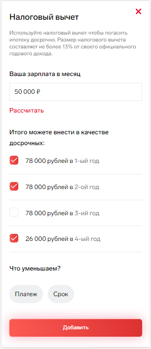
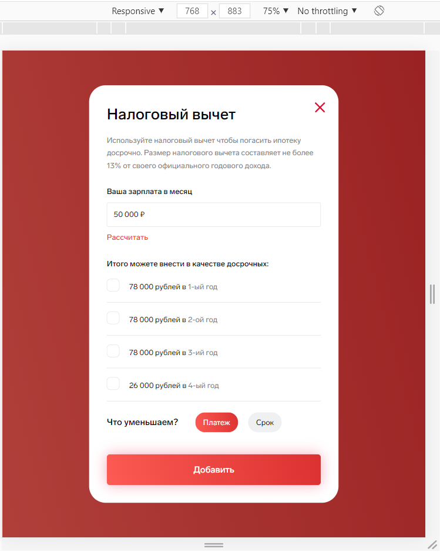

# Тестовое задание - Popup

## Выполнено
* Верстка и адаптив окна под 320, 768 и 1200+ пикселей
* Добавлена логика для открытия/закрытия окна
* Добавлена логика расчета и показа чек-боксов, исходя из зарплаты, введенной в инпуте

Для запуска проекта:
* Скачайте репозиторий ```git clone https://github.com/matrix-web/popup.git```
* Установите зависимости ```npm install```
* Запустите сборку командой ```parcel src/index.html```

## Preview

Мобильные устройства 320px



Планшеты 768px



Desktop 1200px


## :open_file_folder: Файловая структура

```
popup
├── dist
├── src
│   ├── css
│   ├── fonts
│   ├── img
│   └── js
├── index.html
├── package.json
└── .gitignore
```
